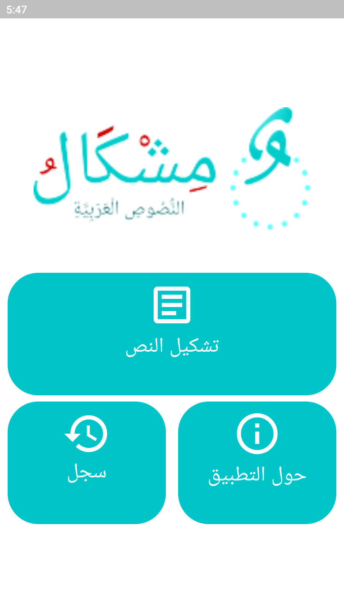

# Mishkal Mobile Application

Mishkal is a mobile application developed using Flutter, based on the [Mishkal website](https://tahadz.com/mishkal). It is designed for adding tashkil (diacritics) to Arabic texts.


## Screenshots

### Home Screen
This is the main screen, providing access to all the key features.


### Tashkil Process
The screen where users can input text and add tashkil to it.


## Features

- **Tashkil Support**: Automatically adds diacritics to Arabic texts for improved readability.
- **Intuitive UI**: User-friendly interface designed to simplify interaction, with full Arabic support.
- **Mobile Optimized**: The application adapts perfectly to mobile devices, providing a seamless experience.


## Installation

1. Clone the repository:
   ```bash
   git clone https://github.com/oualidrouabah/mishkal-app.git
2. Navigate to the project directory:
    ```bash
    cd mishkal-app
3. Install dependencies:
    ```bash
    flutter pub get
4. Run the app:
    ```bash
    flutter run

## Credits

This mobile application is based on the original Mishkal project created by [linuxscout](https://github.com/linuxscout). The project uses the Mishkal API for the Arabic diacritization process.